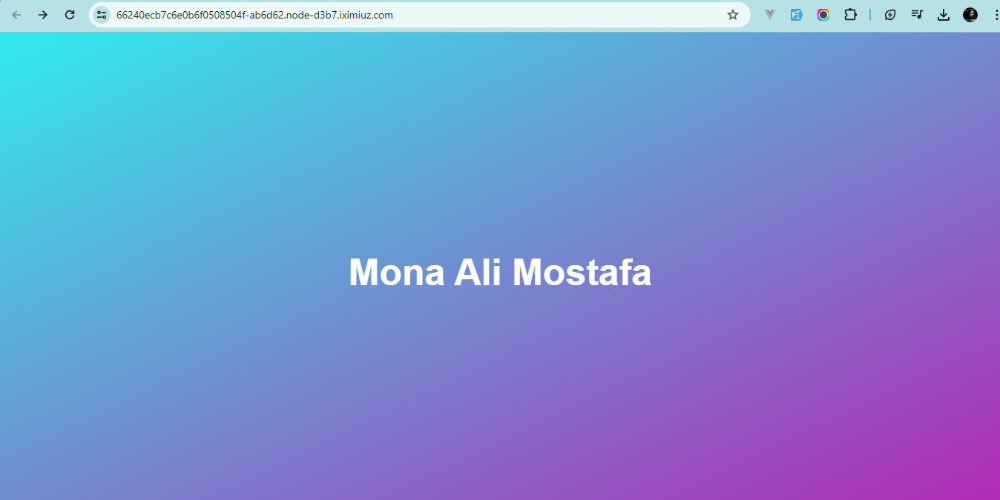

# ITI - Docker Lab One🐋

## Task 1: Working with Docker Hello-world Image
### Objective
Learn how to run a container using the hello-world image and manage containers and images.

### Steps
#### 1. Run a Container with hello-world Image
```bash
docker pull hello-world
docker run hello-world
```
#### 2. Check Container Status and Explain
```bash
docker ps -a
- output : 
CONTAINER ID   IMAGE         COMMAND    CREATED              STATUS                          PORTS     NAMES
e08daeaae1ad   hello-world   "/hello"   About a minute ago   Exited (0) About a minute ago             charming_elbakyan
```
#### 3. Start the Stopped Container
```bash
docker start charming_elbakyan   or   docker start e08daeaae1ad
```
#### 4. Remove the Container
```bash
docker rm charming_elbakyan
```
#### 5. Remove the Image
```bash
docker rmi hello-world 
```
---

## Task 2: Running Container with Ubuntu Image
### Objective
Run an Ubuntu container in interactive mode, create a file inside it, and manage containers.

### Steps
#### 1. Run Ubuntu Container in Interactive Mode
```bash
docker pull ubuntu
docker run -it ubuntu 

- output: 
root@574d98a6416e:/# 

if image like nginx can run use:
docker run -d nginx
docker exec -it festive_galois bash
```
#### 2. Create a File inside the Container
```bash
touch hello-docker -> write any content in it 
```
#### 3. Stop and Remove the Container
```bash
exit

docker ps -a
- output
CONTAINER ID   IMAGE     COMMAND       CREATED              STATUS                            PORTS     NAMES
574d98a6416e   ubuntu    "/bin/bash"   4 minutes ago   Exited (0) 55 seconds ago                        magical_nash

docker stop magical_nash
docker rm magical_nash
```
#### 4. Check File Status
```bash
docker run --rm -it ubuntu ls

File hello-docker not founded

```
#### 5. What happened to hello-docker file?
```bash
All changes made inside the container are discarded, including the hello-docker file after the container is removed.
So, The file hello-docker is deleted along with the container.

```
#### 6. Remove All Stopped Containers
```bash
docker container prune -f
```
#### 7. Bonus: Remove All Containers in One Command
```bash
docker system prune -af
```

---

## Task 3: Creating a Custom Nginx Docker Image
### Objective
Create a custom Docker image using Nginx and a local HTML file.

### Steps
#### 1. Create a Local HTML File
```bash
- docker pull nginx
- docker images
output:
REPOSITORY   TAG       IMAGE ID       CREATED       SIZE
nginx        latest    2ac752d7aeb1   4 days ago    188MB

- vim index.html -> write any content in it 
```
#### 2. Write Dockerfile and Copy the HTML file to the Docker Image
```bash
-vim Dockerfile

- Content: 
FROM nginx                                                                                                                                    
COPY index.html /usr/share/nginx/html/index.html
```

#### 3. Run Container with New Image
```bash
docker build -t nginx-mona:v1.0 .
docker images

- Output:
REPOSITORY     TAG       IMAGE ID       CREATED         SIZE
nginx-mona   v1.0     ed9de6f2b5c4   4 seconds ago   188MB

docker run -d -p 8080:80 nginx-mona:v1.0

or by use image id

docker run -d -p 8080:80 ed9de6f2b5c4

- Output:
d5dec299074c5d5921207076aa26a1f4fa4432c471965efe88c474016d80ff2e
```

#### 4. Test the Container, open your browser and navigate to http://localhost:8088 to check if everything is okay
```bash
I use play ground and when use port 8080 and get link when open it find content of index.html
https://66240ecb7c6e0b6f0508504f-ab6d62.node-d3b7.iximiuz.com/
```



---------------------------------------------------------------------
# ITI - Docker Lab Two🐋
## Task 1: Run a container using nginx image, and mount a directory from your host into the Docker container.
example: /home/samy/nginx:/home/nginx (bind mount)

### Steps
#### 1. Create Bind Mount Directory
```bash
mkdir nginx_bindMount
cd nginx_bindMount
pwd
```

#### 2. Run a container using nginx image
```bash
docker run -d --name nginx_bindMount -v /root/nginx_bindMount:/user/share/nginx/html nginx
docker exec -it nginx_bindMount bash
```

#### 3. Echo any content to show when curl ip-address
```bash
cd /user/share/nginx/html
echo "Hello from Bind Mount Nginx" > index.html
exit
docker inspect -f '{{.NetworkSettings.IPAddress}}' nginx_bindMount    ->172.17.0.2
curl 172.17.0.2
```

---
## Task 2: Create 2 docker network (net-1 & net-2)

### Steps
#### 1. Create 2 docker network (net-1 & net-2)
```bash
docker network create network_1
docker network create network_2
```

#### 2. Run 2 new containers using nginx:alpine image, and attach the net-1 to them.
```bash
docker run -d --name nginx_net1 --net network_1 nginx:alpine
docker run -d --name nginx_net2 --network network_1 nginx:alpine
```

#### 3. Run another 1 new containers using nginx:alpine image, and attach the net-2 to them.
```bash
docker run -d --name nginx_net3 --net network_2 nginx:alpine
```

#### 4. Inspect the 3 containers to know their IPs and write them aside.
```bash
docker inspect -f '{{.NetworkSettings.Networks.network_1.IPAddress}}' nginx_net1
172.18.0.2

docker inspect -f '{{.NetworkSettings.Networks.network_1.IPAddress}}' nginx_net2
172.18.0.3

docker inspect -f '{{.NetworkSettings.Networks.network_2.IPAddress}}' nginx_net3
172.20.0.2
can use : docker inspect nginx_net1 | grep IPAddress
```

#### 5. Enter a container in the net-1 network and try to ping a container in the net-2 network (What do you notice?)
```bash
docker exec -it nginx_net1 sh 
Use ping or curl
ping 172.20.0.2
ping fails, because the two containers exist in different networks so we can see any response in terminal.
```

#### 6. Enter a container in the net-1 network and try to ping the other container in the same network (What do you notice?)
```bash
docker exec -it nginx_net1 sh 
curl 172.18.0.2
ping 172.18.0.3
ping successful and return response, because the two containers exist in the same network.
```